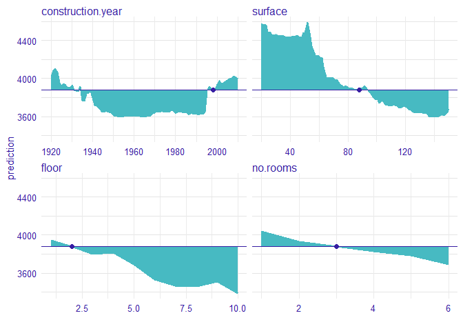
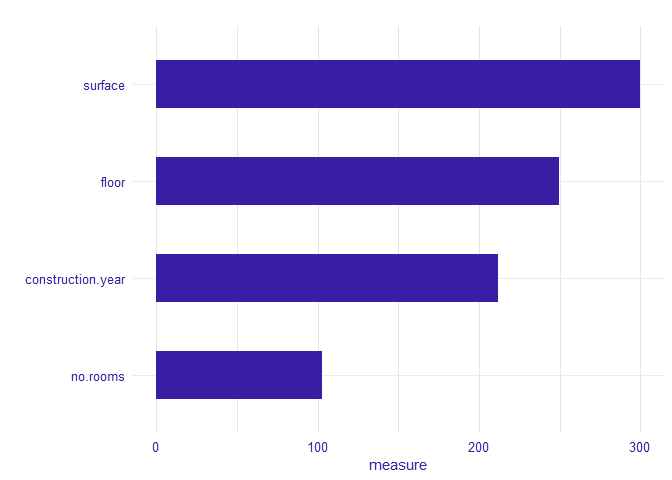

The vivo package - variable importance measure based on Ceteris Paribus profiles
==================================================================================================================

[](https://travis-ci.com/kozaka93/vivo)
[](https://codecov.io/gh/kozaka93/vivo)

This package is a tool for calculated variable importance. The measure is based on Ceteris Paribus plot and calculated in eight variants. We obtain eight variants measure through the possible options of three parameters such as `absolute_deviation`, `point` and `density`.

Installation
------------

``` r
install.packages("devtools")
library("devtools")
install_github("kozaka93/vivo")
```

Intuition
---------

Ceteris Paribus is a latin pharse meaning „other things held constant” or  „all else unchanged”. Ceteris Paribus Plots shows how the model response depends on changes in a single input variable, keeping all other variables uncharged. They are working for any Machine Learning model and allow for model comparisons to better understend how a black model is worinkg.

The measure is based on Ceteris Paribus profiles oscillations. In particular, the larger influence of an explanatory variable on prediction at a particular instance, the larger the deviation along the corresponding Ceteris Paribus profile. For a variable that exercises little or no influence on model prediction, the profile will be flat or will barely change. 


Let consider a example

#### 1 Dataset

We work on Apartments dataset from `DALEX` package.

```r
library("DALEX")
data(apartments)
```

#### 2 Build a model

We define a random forest regression model.

```r
library("randomForest")
#model
apartments_rf_model <- randomForest(m2.price ~ construction.year + surface + floor +
                                      no.rooms, data = apartments)
#explainer from DALEX
explainer_rf <- explain(apartments_rf_model,
                        data = apartmentsTest[,2:5], y = apartmentsTest$m2.price)
```

#### 3 Ceteris Paribus profiles

Now, we calculate Ceteris Paribus profiles for new observation.

```r
new_apartment <- data.frame(construction.year = 1998, surface = 88, floor = 2L, no.rooms = 3)

library("ingredients")
#calcutale ceteris paribus profiles
profiles <- ceteris_paribus(explainer_rf, new_apartment)

#plot ceteris paribus
plot(profiles) + show_observations(profiles)
```


### 4 Measure based on Ceteris Paribus profiles

The value of the colored area is our measure. The larger area, the more important is the variable.


```r
y_predict = predict(apartments_rf_model, new_apartment)
plot(profiles) + geom_ribbon(aes(ymin = y_predict, ymax = predict(apartments_rf_model, profiles)),
            alpha = 1,fill = '#47bac2') + geom_hline(yintercept = y_predict, colour = theme_drwhy_colors(1)) +show_observations(profiles)  
```


We calculated measure with parameters `absolute_deviation`, `point` and `density` equal to true. This means that the deviation is calculated as a distance from observation, not from the average. Measure is weighted based on the density of variable and we use absolute deviation. 


```r
library("vivo")

#calculate measure with all parameter are true
measure <- local_variable_importance(profiles, apartments, absolute_deviation = TRUE, point = TRUE, density = TRUE)

plot(measure)
```



For the new observation the most important variable is surface, then floor, construction.year and no.rooms.
